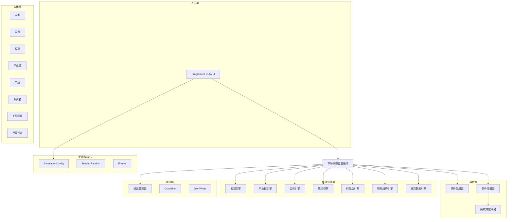

## 产品概述

一个基于VB.NET/.NET 10的宏观经济与股票市场模拟器，模拟多国产业链、跨国贸易、金融政策与事件驱动的蝴蝶效应，最终生成六大类量化交易数据供ML模型测试使用。

## 核心功能

- **多国经济模拟**：模拟15+个国家，每个国家拥有独立的货币、汇率、利率、GDP/CPI/PPI/PMI等宏观指标，可调整进出口关税、购买他国国债
- **产业链建模**：每个国家拥有不同分类的产业链（工业原材料、农业产品、信息技术产品、高科技产品等），含供应商、生产商、消费者多层结构
- **上市公司经营模拟**：100+家上市公司分布于各国各行业，模拟营收、利润、资产、现金流等财务数据，计算PE/PB/PS/ROE/ROA等估值与盈利指标
- **事件驱动蝴蝶效应**：关税变化、政策调整、研发突破、投资者追高、巨头做空、战争摩擦等事件通过对象关联网络传播，层层放大影响最终作用于股价
- **股价生成**：多因子定价模型综合基本面、宏观环境、事件冲击、市场情绪生成OHLC/VWAP/成交量/换手率等量价数据
- **衍生品与跨市场**：期权隐含波动率、期货基差、大宗商品价格、汇率波动
- **另类数据生成**：新闻情绪文本、供应链订单数据、高管增减持、股权质押与限售解禁
- **微观结构日频聚合**：订单流不平衡度、大单成交统计、主买/主卖比例（日频聚合，不含逐笔Tick）
- **数据输出**：CSV存储扁平时序数据，JSON存储世界拓扑与事件流，按数据类别分目录组织

## 技术栈

- **语言**: VB.NET
- **框架**: .NET 10.0, 仅使用BCL（System.IO, System.Text.Json, System.Collections.Generic, System.Random等）
- **无第三方依赖**: CSV手写（StringBuilder + StreamWriter），JSON使用System.Text.Json
- **确定性**: 种子化System.Random保证模拟可复现

## 实现方案

### 总体策略

采用分层架构 + 事件驱动模拟循环。每个时间步按固定顺序执行各Engine（宏观→产业链→公司经营→事件生成→事件传播→股价定价→衍生品→微观结构→另类数据→输出），确保数据依赖关系正确。蝴蝶效应通过有向关系图上的BFS传播实现，带衰减系数和深度限制。

### 关键技术决策

**1. 股价多因子定价模型**
股价 = f(基本面价值, 宏观调整因子, 事件冲击因子, 市场情绪因子, 随机噪声)

- 基本面价值：每股收益 × 合理PE（PE受行业、增长率影响）
- 宏观调整：利率上升→折现率上升→估值压缩；GDP增长→盈利预期上调
- 事件冲击：通过蝴蝶效应网络传播的累积影响系数
- 情绪因子：VIX、动量、投资者行为（追高/恐慌）的综合映射
- 日内OHLC：以收盘价为基础，根据当日波动率和成交量分布反推开高低价

**2. 蝴蝶效应传播网络**

- 构建有向加权图：节点=实体（国家/公司/产业链），边=关系（供应链/贸易/持股/竞争）
- 事件产生初始冲击值，沿边BFS传播，每跳衰减（如×0.6），最大深度3跳
- 边权重反映关系强度（如供应链依赖度、贸易额占比）
- 传播结果为每个受影响实体累积的冲击值，映射到股价变动百分比

**3. 宏观经济动态**

- GDP增速：受消费、投资、净出口驱动，受事件（战争、政策）影响
- CPI/PPI：受原材料价格、关税、货币供应影响
- 利率与汇率：央行按周期调整，受通胀和经济增长目标驱动；汇率受利率差和贸易平衡影响
- 国债收益率：跟随基准利率 + 期限溢价 + 风险溢价

**4. 产业链与贸易**

- 每条产业链：上游原材料→中游制造→下游消费，各环节有产能、库存、价格
- 跨国贸易：基于各国比较优势（产业分类）+ 关税成本 + 汇率影响决定贸易流向
- 供应链冲击（如原材料涨价）沿产业链向下游传播，影响公司成本和利润

**5. 性能优化**

- 使用StringBuilder批量构建CSV行，每文件一次性写入（避免逐行IO）
- 事件传播使用邻接表 + 队列BFS，避免递归栈溢出
- 实体引用使用ID索引 + Dictionary查找，避免线性搜索
- 预计算交易日历，跳过非交易日
- 100+公司 × 252交易日 × 5年 ≈ 12.6万数据点/类型，总数据量约百万级行，内存可控

## 架构设计

### 系统架构图



### 模拟主循环时序（每个时间步）

```
1. MacroEngine.Step()       — 更新各国宏观指标（GDP/CPI/PMI/利率/汇率/货币供应）
2. IndustryChainEngine.Step() — 产业链生产/贸易/供应链传导
3. CompanyEngine.Step()     — 公司经营（营收/成本/利润/现金流更新）
4. EventGenerator.Step()    — 按概率生成各类事件
5. EventPropagator.Step()   — 蝴蝶效应传播，计算各实体冲击值
6. StockPriceEngine.Step()  — 多因子定价，生成OHLC/VWAP/成交量
7. DerivativesEngine.Step() — 期权IV/期货基差/大宗商品/汇率
8. MicrostructureEngine.Step() — 日频微观结构聚合
9. AlternativeDataEngine.Step() — 新闻情绪/高管/质押/供应链
10. OutputManager.Step()    — 缓冲写入CSV/JSON
```

## 目录结构

```
src/SuperMarket/
├── SuperMarket.vbproj              # [MODIFY] 添加 OutputType=Exe
├── SuperMarket.slnx                # [保持不变]
├── Market.vb                       # [MODIFY] 改为 MarketSimulator 主模拟器类，编排所有引擎
├── Program.vb                      # [NEW] CLI入口，解析参数(起止日期/分辨率/规模/种子/输出路径)，启动模拟
│
├── Core/                           # 核心基础设施
│   ├── Enums.vb                    # [NEW] 所有枚举：ProductCategory(IndustrialRawMaterial/Agricultural/IT/HighTech/ConsumerGoods/Energy)、IndustryType、EventType(TariffChange/PolicyChange/RDBreakthrough/InvestorChase/WhaleShort/WarFriction/CurrencyDevaluation/InterestRateChange/SupplyChainDisruption/MarketCrash等)、InvestorType(Retail/Institutional/Whale)、Resolution(Daily/Minute)、SentimentLevel
│   ├── SimulationConfig.vb         # [NEW] 模拟配置：StartDate, EndDate, Resolution, CountryCount, CompanyCount, Seed, OutputPath, EventFrequency, TradingDaysPerYear等
│   └── SeededRandom.vb             # [NEW] 种子化随机数辅助类，封装System.Random，提供NextDouble/Next/NextGaussian/Sample等方法
│
├── Entities/                       # 实体定义
│   ├── Country.vb                  # [NEW] 国家实体：Name, Currency, ExchangeRate, InterestRate, GDP, GDPGrowth, CPI, PPI, PMI, NonFarmPayroll, M1, M2, TreasuryYields(各期限), VIX贡献, Tariffs(按产品类别×贸易伙伴国), IndustryChains, PoliticalStability
│   ├── Company.vb                  # [NEW] 公司实体：Name, Country, Industry, ProductCategory, Revenue, CostOfGoodsSold, NetProfit, TotalAssets, TotalLiabilities, OperatingCashFlow, SharesOutstanding, FreeFloatRatio, InsiderHoldings, PledgeRatio, UnlockDates, SupplyChainRole, RDLevel, Competitiveness
│   ├── Stock.vb                    # [NEW] 股票实体：Ticker, Company, PreviousClose, Open, High, Low, Close, VWAP, Volume, Amount, TurnoverRate, MarketCap, PE, PB, PS, DividendYield, Beta, Volatility
│   ├── IndustryChain.vb            # [NEW] 产业链：Name, Country, Category, UpstreamNodes, DownstreamNodes, ProductionCapacity, UtilizationRate, Inventory, ProductPrice, Demand, Supply
│   ├── Product.vb                  # [NEW] 产品：Name, Category, BasePrice, CurrentPrice, DemandElasticity, SupplyElasticity, ProducerCountry, GlobalSupply, GlobalDemand
│   ├── Investor.vb                 # [NEW] 投资者：Type(Retail/Institutional/Whale), RiskAppetite, HoldingPeriod, ChaseTendency, ShortTendency, CapitalSize, AffectedStocks
│   ├── Relationship.vb             # [NEW] 关系：SourceType, SourceId, TargetType, TargetId, RelationType(SupplyChain/Trade/CrossHolding/TreasuryHolding/Competition/Ownership), Weight, Description
│   └── WorldSetup.vb               # [NEW] 世界设定生成器：创建15+国家(含名称/货币/初始宏观参数/产业链分布)，100+公司(含行业/国家/初始财务/供应链关系)，跨国贸易关系，国债持有关系，初始汇率矩阵
│
├── Events/                         # 事件系统
│   ├── MarketEvent.vb              # [NEW] 事件基类 + 所有具体事件类型：EventId, Timestamp, EventType, SourceEntityId, SourceEntityType, Description, InitialImpact, ImpactDecay, MaxPropagationDepth, AffectedCategory；具体类型含TariffChangeEvent/PolicyChangeEvent/RDBreakthroughEvent/InvestorChaseEvent/WhaleShortEvent/WarFrictionEvent/CurrencyDevaluationEvent/InterestRateChangeEvent/SupplyChainDisruptionEvent/MarketCrashEvent/SectorRotationEvent/EarningsSurpriseEvent等
│   ├── EventGenerator.vb           # [NEW] 事件生成器：按配置的事件频率和概率分布，每时间步随机生成0-N个事件；不同事件类型有不同的基础概率和触发条件（如战争摩擦仅在政治不稳定国家间触发）；支持季节性事件（如财报季）
│   └── EventPropagator.vb          # [NEW] 事件传播器：接收事件，在ButterflyEffectNetwork上BFS传播冲击值；每跳×衰减系数(默认0.6)，最大深度3；输出每个受影响实体的累积冲击值Map(EntityId→ImpactValue)；记录传播路径用于事件流JSON
│
├── Simulation/                     # 模拟引擎
│   ├── ButterflyEffectNetwork.vb   # [NEW] 蝴蝶效应网络：构建有向加权邻接表图；AddEdge/AddNode；BFSPropagate(event)方法；维护实体间关系强度权重；支持按关系类型过滤传播路径
│   ├── MacroEngine.vb              # [NEW] 宏观引擎：每步更新各国GDP增速(受消费+投资+净出口+事件冲击驱动)、CPI/PPI(受原材料价格+关税+货币供应驱动)、PMI(景气扩散)、非农就业、利率(央行泰勒规则)、汇率(利率平价+贸易平衡)、国债收益率曲线、M1/M2、VIX(市场波动聚合)、融资融券余额、资金流向
│   ├── IndustryChainEngine.vb      # [NEW] 产业链引擎：每步更新各产业链产能利用率、库存、产品价格(供需均衡)、跨国贸易流(比较优势+关税+汇率)、供应链成本传导(上游涨价→下游成本上升)；输出产品价格供宏观和公司引擎使用
│   ├── CompanyEngine.vb            # [NEW] 公司引擎：每步更新公司营收(受产品价格×销量+行业增长+事件冲击)、成本(受供应链价格+关税+汇率)、利润(营收-成本-税费)、现金流、资产负债表；计算PE/PB/PS/ROE/ROA/毛利率/股息率；处理高管增减持/股权质押/限售解禁事件
│   ├── StockPriceEngine.vb         # [NEW] 股价引擎：多因子定价——基本面价值(EPS×合理PE)×宏观调整因子(利率/经济增长)×事件冲击因子(累积冲击值)×情绪因子(VIX/动量/投资者行为)×随机噪声；生成OHLC(基于收盘价和波动率反推)、VWAP、成交量(换手率×流通股×情绪)、成交金额；处理涨跌停限制
│   ├── DerivativesEngine.vb        # [NEW] 衍生品引擎：期权隐含波动率(基于标的股波动率+VIX+事件冲击)、看跌/看涨比率(基于市场情绪)、股指期货基差(期现价差)、大宗商品价格(产业链产品价格聚合)、汇率数据(宏观引擎提供)
│   ├── MicrostructureEngine.vb     # [NEW] 微观结构引擎(日频聚合)：订单流不平衡度(基于当日买卖压力)、大单成交统计(基于成交量分布和大户行为)、主买/主卖比例(基于情绪和投资者类型分布)、滑点估算
│   └── AlternativeDataEngine.vb    # [NEW] 另类数据引擎：新闻情绪文本生成(基于事件类型模板+情绪得分)、社交媒体情绪(基于投资者行为)、供应链订单数据(产业链引擎输出)、高管增减持记录、股权质押比例、限售解禁日期、卫星图像代理数据(如零售公司停车场车辆数=营收代理指标)
│
├── Output/                         # 输出系统
│   ├── OutputManager.vb            # [NEW] 输出管理器：协调所有数据的缓冲与写入；维护输出目录结构；每步缓冲数据，定期刷盘；模拟结束后写入拓扑JSON和事件流JSON
│   ├── CsvWriter.vb                # [NEW] CSV写入器：使用StringBuilder批量构建行，StreamWriter写入；支持追加模式和新建模式；自动处理逗号转义
│   ├── JsonWriter.vb               # [NEW] JSON写入器：使用System.Text.Json.Utf8JsonWriter写入结构化JSON；支持世界拓扑、产业链结构、事件流、关系图
│   └── OutputSchema.vb             # [NEW] 输出模式定义：定义每个CSV文件的列头和文件路径规则；定义JSON文件的结构模板
│
└── Data/                           # 运行时生成的输出数据（默认输出目录）
    ├── price/                      # 量价数据CSV：{ticker}_price.csv
    ├── fundamentals/               # 基本面数据CSV：{ticker}_fundamentals.csv
    ├── macro/                      # 宏观经济CSV：{country}_macro.csv
    ├── alternative/                # 另类数据CSV/JSON
    ├── derivatives/                # 衍生品CSV
    ├── microstructure/             # 微观结构CSV：{ticker}_microstructure.csv
    └── topology/                   # JSON拓扑与事件流
```

### 输出文件Schema

**CSV文件（扁平时序数据）：**

| 数据类别 | 文件路径 | 列定义 |
| --- | --- | --- |
| 量价数据 | `price/{ticker}_price.csv` | Date,Open,High,Low,Close,VWAP,Volume,Amount,TurnoverRate,MarketCap |
| 基本面数据 | `fundamentals/{ticker}_fundamentals.csv` | Date,Revenue,NetProfit,TotalAssets,TotalLiabilities,OperatingCF,PE,PB,PS,DividendYield,ROE,ROA,GrossMargin |
| 宏观经济 | `macro/{country}_macro.csv` | Date,GDPGrowth,CPI,PPI,PMI,NonFarmPayroll,TreasuryYield10Y,InterbankRate,M1,M2,VIX,MarginBalance,NorthFlow |
| 供应链数据 | `alternative/supply_chain/{ticker}_supplychain.csv` | Date,OrderVolume,SupplierOrderValue,InventoryTurnover,CustomerDemandIndex |
| 高管/质押 | `alternative/insider/{ticker}_insider.csv` | Date,Action,BuyAmount,SellAmount,PledgeRatio,UnlockDate,UnlockShares |
| 期权数据 | `derivatives/options/{underlying}_options.csv` | Date,ImpliedVolatility,PutCallRatio,OptionVolume |
| 期货数据 | `derivatives/futures/{contract}_futures.csv` | Date,FuturesPrice,SpotPrice,Basis,BasisPct |
| 大宗商品 | `derivatives/commodities/{commodity}_commodity.csv` | Date,Price,Volume,ChangePct |
| 汇率数据 | `derivatives/fx/{pair}_fx.csv` | Date,Rate,ChangePct |
| 微观结构 | `microstructure/{ticker}_microstructure.csv` | Date,OrderImbalance,LargeOrderCount,LargeOrderAmount,BuyRatio,SellRatio,Slippage |


**JSON文件（拓扑与事件流）：**

| 文件路径 | 内容 |
| --- | --- |
| `topology/world_topology.json` | 国家列表(含宏观属性)、公司列表(含行业/国家)、股票列表、产业链结构、投资者列表 |
| `topology/relationships.json` | 所有关系边（供应链/贸易/持股/国债/竞争），含源/目标/类型/权重 |
| `topology/industry_chains.json` | 各国产业链完整结构：节点、层级、产能、产品类别 |
| `topology/event_log.json` | 事件流：每个事件含时间戳、类型、源实体、描述、初始冲击、传播路径、受影响实体及冲击值 |


## 实现要点

- **确定性保证**：所有随机操作通过SeededRandom，同一种子产生相同结果。世界设定生成也使用种子化随机
- **事件传播效率**：BFS + 邻接表，每事件最多遍历3跳邻居，单次传播O(V+E)其中V为邻居子图节点数；100+公司规模下单步传播开销可忽略
- **CSV写入性能**：每文件使用StringBuilder缓冲全部行后一次性写入，避免频繁IO；大文件(如宏观数据)按年分文件可选
- **内存管理**：时序数据在模拟期间保存在内存List中，模拟结束后统一写入；100+公司×252日×5年≈12.6万行/类型，内存占用可控
- **向后兼容**：保留Market.vb文件名，改为MarketSimulator类，保持项目入口一致性
- **日志与可观测性**：Console输出模拟进度(当前日期/总进度百分比)、事件统计摘要、输出文件统计；错误时输出诊断信息
- **错误处理**：文件IO异常捕获并重试；数值溢出保护（价格/指标范围校验）；事件传播中的循环引用防护（visited集合）

## 关键代码结构

### SimulationConfig 配置结构

```vb.net
Public Class SimulationConfig
Public Property StartDate As Date
Public Property EndDate As Date
Public Property Resolution As Resolution  ' Daily / Minute
Public Property CountryCount As Integer   ' 默认16
Public Property CompanyCount As Integer   ' 默认120
Public Property Seed As Integer           ' 默认42
Public Property OutputPath As String      ' 默认 "./Data"
Public Property EventFrequencyPerDay As Double  ' 默认2.0
Public Property TradingDaysPerYear As Integer   ' 默认252
' 事件类型概率权重
Public Property EventWeights As Dictionary(Of EventType, Double)
End Class

```

### MarketEvent 事件基类
```vb.net
Public MustInherit Class MarketEvent
    Public Property EventId As Integer
    Public Property Timestamp As Date
    Public Property EventType As EventType
    Public Property SourceEntityId As Integer
    Public Property SourceEntityType As Type
    Public Property Description As String
    Public Property InitialImpact As Double       ' 初始冲击值 [-1, 1]
    Public Property ImpactDecay As Double         ' 每跳衰减系数 默认0.6
    Public Property MaxPropagationDepth As Integer ' 最大传播深度 默认3
    Public Property AffectedCategory As ProductCategory?  ' 影响的产品类别(None=全类别)
    ' 传播结果
    Public Property PropagationPath As List(Of (EntityId As Integer, EntityType As Type, Impact As Double))
End Class
```

### 主模拟循环结构（MarketSimulator）

```vb.net
Public Class MarketSimulator
Private ReadOnly _config As SimulationConfig
Private ReadOnly _rng As SeededRandom
Private _countries As List(Of Country)
Private _companies As List(Of Company)
Private _stocks As List(Of Stock)
Private _chains As List(Of IndustryChain)
Private _investors As List(Of Investor)
Private _network As ButterflyEffectNetwork
' 各引擎引用
Private _macroEngine As MacroEngine
Private _chainEngine As IndustryChainEngine
' ... 其他引擎

Public Sub Run()
InitializeWorld()
For Each day As Date In TradingCalendar(_config.StartDate, _config.EndDate)
_macroEngine.Step(day)
_chainEngine.Step(day)
_companyEngine.Step(day)
Dim events = _eventGenerator.Step(day)
For Each ev In events
_eventPropagator.Propagate(ev, _network)
Next
_stockEngine.Step(day)
_derivativesEngine.Step(day)
_microstructureEngine.Step(day)
_alternativeDataEngine.Step(day)
_outputManager.BufferStep(day)
Next
_outputManager.FlushAll()
End Sub
End Class
```

## Agent Extensions

### SubAgent

- **code-explorer**
- Purpose: 实现过程中用于验证VB.NET跨文件引用、类继承关系和命名空间一致性
- Expected outcome: 确保多文件VB.NET项目的类型引用正确，无编译级遗漏